# How `_fused_swiglu_wide_packed_save_factors_kernel` runs on Blackwell

A walkthrough of the Triton-generated PTX for the fused SwiGLU forward
kernel that also saves the backward "factors". Goal of this doc: explain
how warp specialization splits the work so that three TMA stores per output
tile cost essentially nothing — they hide behind the next tile's compute.

The full annotated PTX is at `artifacts/save_factors.annotated.ptx`
(~2750 lines). Below we extract only the load-bearing instructions.

---

## Setup

- **Kernel**: `_fused_swiglu_wide_packed_save_factors_kernel`
  (`fused_swiglu/triton_baseline.py`)
- **Hardware**: NVIDIA Blackwell B200, BF16
- **Triton config**:
  `BLOCK_M=128, BLOCK_N_HALF=128, BLOCK_K=64, GROUP_M=32,
   num_warps=8, num_stages=4, WARP_SPECIALIZE=True, FLATTEN=True`
- **Persistent grid**: stride = `NUM_SMS = 148`
- **Per tile output**: one `out` tile (128×128 bf16) + one `factors` tile
  (128×256 bf16) for the backward fast-path

## The 30-second picture

The CTA launches with **12 warps**, not 8 — the `num_warps=8` you pass to
Triton is only the *compute-pool* size. With `WARP_SPECIALIZE=True`,
Triton's WS pass silently adds 4 extra lightweight warps for the
specialized roles. You can confirm this on the compiled object:

```python
compiled = jit_kern.warmup(...)
print(compiled.metadata.num_warps)   # → 12
```

The 12 warps are split by `warp_id` into two physical pools that run
truly in parallel:

```
                                     time ─────────────────────────────────────►
POOL B: TMA-LOAD warp   (role 1)   │ load T+1 k=0 │ k=1 │ k=2 │ k=3 │ ...
POOL B: MMA warp        (role 0)   │ (wait load) mma│ mma │ mma │ mma │ ...
POOL A: 8 compute warps (epilogue) │ tcgen05.ld T │ SwiGLU │ store#1│ wait │ store#2│ wait │ store#3
```

| Pool | Warps | Register budget | Job |
|---|---|---|---|
| **A — Default** | warps 0..7 (8 warps) | `setmaxnreg.inc 240` | TMEM accumulator drain, SwiGLU math, all 3 TMA **stores** |
| **B — Specialized, role 0** | warp 8 (1 warp) | `setmaxnreg.dec 24` | Issue `tcgen05.mma` |
| **B — Specialized, role 1** | warps 9..10 (2 warps) | `setmaxnreg.dec 24` | Issue 3 TMA **loads** per K-iter (X, W_lo, W_hi) |
| **B — Specialized, role 2** | warp 11 (1 warp) | `setmaxnreg.dec 24` | Idle (WS pad — typical Triton convention adds extras in groups of 4) |

(`bar.sync 0, 256` later in the epilogue uses thread count = 8 warps × 32 = 256, and `bar.sync 3, 64` uses 2 warps × 32 = 64 — that's how we know the participating warp count of each barrier.)

They communicate exclusively via shared-memory **mbarriers** — never via
a CTA-wide barrier. The result: the three TMA stores in the epilogue
serialize through one SMEM staging buffer, but the load+MMA pipeline for
tile T+1 runs concurrently with the entire store chain.

---

## Diagrams

### Warp-pool architecture

How a single PTX entry point becomes 3 concurrent worker roles via the
`warp_id` split + role tag dispatch:

```mermaid
flowchart TB
    entry["CTA launch: num_warps = 12 (8 + 4 extra)"]
    entry --> split{"warp_id = tid.x shr 5<br/>is warp_id less than 8?"}

    split -->|yes| poolA["Pool A: DEFAULT<br/>warps 0 to 7<br/>regs = 240<br/>path: BB0_18 to BB0_20"]
    split -->|no|  poolB["Pool B: SPECIALIZED<br/>warps 8 to 11<br/>regs = 24<br/>path: BB0_1 to BB0_2"]

    poolB --> dispatch{"per-warp role tag<br/>ld.shared.b8 then brx.idx"}
    dispatch -->|role 0| mma["MMA warp (warp 8)<br/>BB0_7<br/>4x tcgen05.mma per K-iter"]
    dispatch -->|role 1| load["TMA-LOAD warp (warps 9-10)<br/>BB0_13<br/>3x cp.async.bulk per K-iter<br/>X, W_lo, W_hi"]
    dispatch -->|role 2| idle["idle pad (warp 11)<br/>BB0_17"]
    dispatch -->|role 3| exit_["exit<br/>BB0_28"]

    poolA --- jobA["Job: tcgen05.ld TMEM to regs<br/>SwiGLU math<br/>3x cp.async.bulk.tensor (TMA STORES)<br/>private sync: bar.sync 0, 256"]

    load  -. "FULL mbar (load done)" .-> mma
    mma   -. "EMPTY mbar (buf reuse)" .-> load
    mma   -. "ACC_READY mbar" .-> poolA
    poolA -. "TMEM_FREE mbar" .-> mma

    classDef pool fill:#e8f4ff,stroke:#3b6db5,stroke-width:2px,color:#000
    classDef role fill:#fff4e6,stroke:#d18b1f,stroke-width:2px,color:#000
    classDef misc fill:#f0f0f0,stroke:#888,color:#000
    class poolA,poolB pool
    class mma,load role
    class idle,exit_,jobA misc
```

The dotted arrows are the four SMEM mbarriers that synchronize the
pools. Nothing else crosses pool boundaries — no shared `bar.sync` IDs,
no shared registers, no shared CTA-wide barriers.

### Pipeline timeline (3 tiles in flight)

Steady-state wall-clock view. Each row is a warp group; horizontal
extent is wall-clock time. Mermaid renders this as a Gantt chart so
overlap is unmissable.

```mermaid
gantt
    title Steady-state pipeline - 3 tiles concurrently in flight
    dateFormat  X
    axisFormat  %L

    section TMA-load warp (Pool B role 1)
    K-loop tile T+1 (load X, W_lo, W_hi)  :done,   l1, 0,  60
    K-loop tile T+2                       :active, l2, 55, 115
    K-loop tile T+3                       :        l3, 110, 170

    section MMA warp (Pool B role 0)
    K-loop tile T+1 (56x tcgen05.mma)     :done,   m1, 5,  65
    K-loop tile T+2                       :active, m2, 60, 120
    K-loop tile T+3                       :        m3, 115, 175

    section Compute warps (Pool A epilogue)
    drain T (tcgen05.ld)        :crit, dT, 10, 18
    SwiGLU T                    :      sT, 18, 22
    store 1 factors_lo T        :crit, s1T, 22, 32
    wait SMEM drain             :      w1T, 32, 36
    store 2 factors_hi T        :crit, s2T, 36, 46
    wait SMEM drain             :      w2T, 46, 50
    store 3 out T               :crit, s3T, 50, 60
    drain T+1                   :crit, dT1, 65, 73
    SwiGLU T+1                  :      sT1, 73, 77
    store 1 T+1                 :crit, s1T1, 77, 87
    wait                        :      w1T1, 87, 91
    store 2 T+1                 :crit, s2T1, 91, 101
    wait                        :      w2T1, 101, 105
    store 3 T+1                 :crit, s3T1, 105, 115
```



What the chart shows:

- At the moment the compute warps are running **store #2 of tile T** (~ms
  40), the MMA warp is **mid-K-loop on T+1** and the TMA-load warp is
  **already pulling T+2 from HBM** — three tiles, three concurrent stages.
- The epilogue drain (`drain T+1`) is gated only by `ACC_READY` from the
  MMA warp's tile T+1 completion (~ms 65) — NOT by tile T's store #3
  having committed to HBM.
- Tile T's store #3 stays inflight (off-critical-path) while the next
  tile's drain begins.

---

## Loop structure (the part that's easy to lose in the PTX)

Each of the three roles runs its OWN loop nest. The three nests are NOT
in the same basic block — they're separate loops in separate warps, glued
together only by SMEM mbarriers. This is what the structure looks like
if you write it back out in pseudocode:

```
=====================================================================
 Persistent grid driver (all warps see this — common outer)
=====================================================================
for tile_id in range(my_sm, num_tiles, NUM_SMS=148):
    (pid_m, pid_n) = swizzle(tile_id, GROUP_M=32)

    ─────────────────────────────────────────────────────────────────
     Pool B / role 1 — TMA-LOAD warp   (BB0_2 outer × BB0_13 inner)
    ─────────────────────────────────────────────────────────────────
    for k in range(K / BLOCK_K = 56):
        wait  mbar[k % 4].EMPTY        ← MMA warp signals when done
        arrive mbar[k % 4].FULL  expect_tx = 49152 bytes
        TMA  load  X [pid_m, k]    → smem_X [k%4]    ┐
        TMA  load  W_lo[k, pid_n]  → smem_Wl[k%4]    │ 3 issued in parallel
        TMA  load  W_hi[k, pid_n]  → smem_Wh[k%4]    ┘

    ─────────────────────────────────────────────────────────────────
     Pool B / role 0 — MMA warp        (BB0_2 outer × BB0_7 inner)
    ─────────────────────────────────────────────────────────────────
    for k in range(56):
        wait  mbar[k % 4].FULL         ← load warp signals when ready
        tcgen05.mma  TMEM_acc += smem_X[k%4] @ smem_Wl[k%4]   ┐
        tcgen05.mma  TMEM_acc += smem_X[k%4] @ smem_Wh[k%4]   │ 4× per k-iter
        tcgen05.mma  ...                                      │ (splits the
        tcgen05.mma  ...                                      ┘  BLOCK_K=64
                                                                 along the
                                                                 K axis of
                                                                 the MMA shape)
        arrive mbar[(k-pipeline) % 4].EMPTY     ← release older buffer
    tcgen05.commit  mbar.ACC_READY   ← end-of-tile: accumulator complete

    ─────────────────────────────────────────────────────────────────
     Pool A — 8 compute warps          (BB0_20 — NO inner K-loop)
    ─────────────────────────────────────────────────────────────────
    wait    mbar.ACC_READY              ← MMA warp signals end-of-tile
    tcgen05.ld   TMEM_acc → regs        ← drain accumulator
    arrive  mbar.TMEM_FREE              ← MMA warp may overwrite TMEM now
                                          (next tile can start IMMEDIATELY)
    silu_gate = silu(regs[:128]) * regs[128:]

    # TMA store #1 — factors lo half (backward fast-path inputs)
    smem_stage  ← regs.bf16
    TMA  store  factors[pid_m, pid_n*256 + 0:128]   ← smem_stage
    wait_group.read 0                  ← SMEM drain only, NOT HBM commit

    # TMA store #2 — factors hi half (REUSES same smem_stage buffer)
    smem_stage  ← (regs * sigmoid).bf16
    TMA  store  factors[pid_m, pid_n*256 + 128:256] ← smem_stage
    wait_group.read 0

    # TMA store #3 — the main `out` tile (REUSES same smem_stage)
    smem_stage  ← silu_gate.bf16
    TMA  store  out[pid_m, pid_n*128 + 0:128]      ← smem_stage
    # ^ no wait_group.read after this store — store #3's SMEM drain
    # and HBM commit happen asynchronously; Pool A loops straight back
    # to `wait mbar.ACC_READY` for the NEXT tile.
    # (Pool A still processes tiles serially — what "no wait" buys is
    #  that the inflight store #3 keeps draining while Pool A is parked
    #  on the next ACC_READY wait.)
```

### What overlaps with what (the explicit answer)

To be precise about what the question "does the next tile start while
the compute warps are still working?" actually asks, there are FOUR
distinct overlap windows happening at once. Each pool sees a different
"next tile":

| What's running | What runs concurrently |
|---|---|
| Pool A epilogue for tile T (drain + SwiGLU + 3 stores) | TMA-load warp loads X/W for tile T+1 (all K-iters) |
| Pool A epilogue for tile T (after the `TMEM_FREE` arrive, i.e. immediately after `tcgen05.ld`) | MMA warp issues `tcgen05.mma` for tile T+1 into the freshly released TMEM |
| Pool A's TMA store #3 of tile T (still draining in HBM) | Pool A is already parked on `wait mbar.ACC_READY` for tile T+1; the inflight store doesn't block the next epilogue |
| Pool A's epilogue for tile T+1 starts | Pool B is already issuing tile T+2's TMA loads (num_stages=4 buffer ring is that deep) |

So **for Pool A specifically**, tiles are processed strictly serially —
the 8 compute warps don't start tile T+1's drain while still mid-tile-T.
But the inflight store #3 of tile T continues to drain in the background,
and **all of Pool B is already running ahead** by the time Pool A wakes
up on `ACC_READY` for the next tile. Net effect: the compute-warp pool
is doing the most expensive thing it can possibly do every cycle
(register-cvt → SMEM stage → TMA issue), with no idle gaps for
load/MMA latency.

### Wall-clock timeline (steady state, 3 tiles)

The 3 rows are 3 physical warp groups; each column is a time slice;
vertically aligned cells happen concurrently. Mbarrier events that
synchronize across pools are drawn as vertical pipes `│ … │`.

```
                  ◄── tile T ──►   ◄── tile T+1 ──►  ◄── tile T+2 ──►
                                                     │
 LOAD warp        K-loop T+1       K-loop T+2        │ K-loop T+3
   (Pool B r1)    [56 cp.async]    [56 cp.async]     │ [56 cp.async]
                  ───────────────  ────────────────  │ ───────────────
                       FULL│           FULL│         │      FULL│
                           ▼               ▼         │          ▼
 MMA warp         K-loop T+1       K-loop T+2        │ K-loop T+3
   (Pool B r0)    [56 wait+mma]    [56 wait+mma]     │ [56 wait+mma]
                  ─────────────?   ────────────?     │
                          ACC_READY│         ACC_READY│
                                   ▼                  ▼
 Compute warps    drain T │ swig │ st#1│w│ st#2│w│ st#3 │drain T+1│ swig │ st#1│ w │ st#2 │ w │ st#3
   (Pool A)             │                                │
                  TMEM_FREE│                       TMEM_FREE│
                          └──── unblocks MMA T+1 ──┘
                                                 │
                  (store #3 of T is still draining
                   in HBM here, async, off-critical-path)
```

Reading the picture: at any wall-clock instant in steady state,
**THREE different tiles are in flight simultaneously** —
Pool A is finalizing tile T in HBM, MMA warp is mid-K-loop on T+1, and
the TMA-load warp is feeding T+2 into the SMEM ring buffer (depth = 4).

The "no wait after store #3" comment in the pseudocode is what makes
the picture seamless: if Pool A waited for store #3's SMEM-drain before
looping, there'd be a small stall gap before the next tile's drain.
With `FLATTEN=True` + persistent grid, the loop branch goes straight
back to `wait ACC_READY`, and store #3's drain happens during whatever
small gap is left between Pool B finishing T+1's MMA and Pool A picking
up ACC_READY.

### Three things to notice about the structure itself

1. **The MMA warp and TMA-load warp run a NESTED `(tile × K)` loop** —
   they reuse `num_stages=4` SMEM buffers in a classic producer/consumer
   ring. Both are `Depth=2` in the PTX loop annotations.

2. **Pool A has NO inner K-loop.** Its tile-loop body is just one
   accumulator drain + SwiGLU + 3 TMA stores. All K-axis work is offloaded
   to Pool B.

3. **TMEM is released BEFORE the stores even start.** The `arrive
   mbar.TMEM_FREE` happens right after `tcgen05.ld` finishes — well before
   store #1. So tile T+1's MMA can begin immediately; it does NOT wait for
   tile T's HBM stores.

---

## 1. Entry: split the CTA into two warp pools

```ptx
// %tid.x → warp_id → pool
mov.u32           %r1, %tid.x;
shr.u32           %r2, %r1, 5;                // warp_id = tid >> 5
shfl.sync.idx.b32 %r3, %r2, 0, 31, -1;        // broadcast lane-0 warp_id
setp.lt.u32       %p1, %r3, 8;                // %p1 = (warp_id < 8)
@%p1 bra          $L__BB0_18;                 // warps 0..7 → DEFAULT (Pool A)
bra.uni           $L__BB0_1;                  // warps 8..N → SPECIALIZED (Pool B)
```

Pool A goes to **`BB0_18`** (epilogue + stores). Pool B goes to **`BB0_1`**,
which further partitions each warp into a role by reading a per-warp tag
from SMEM:

```ptx
$L__BB0_2:
    setmaxnreg.dec.sync.aligned.u32 24;       // specialized warps: lightweight
    ld.shared.b8    %r18, [%r20+229464];      // each warp reads ITS OWN byte
                                              // (%r20 = smem + warp_id)
    brx.idx %r18, $L_brx_0;                   // role dispatch:
        // role 0 → BB0_5  → BB0_7   (MMA warp)
        // role 1 → BB0_11 → BB0_13  (TMA-LOAD warp)
        // role 2 → BB0_17           (idle)
        // role 3 → BB0_28           (exit)
```

That's how a single PTX entry-point implements 3+ different worker roles
without runtime overhead — each warp's role is decided once, by reading
a different SMEM byte.

---

## 2. Pool B / role 1 — the TMA-LOAD warp (`BB0_13`)

Two specialized warps live here. Their entire job per K-iter is: wait
until the previous stage's SMEM buffer has been drained by the MMA warp,
then fire three parallel TMA loads into the next stage.

```ptx
$L__BB0_13:                       // K-loop body for the load warp
    // 1. Wait for "buffer empty" from the MMA warp.
    mbarrier.try_wait.parity.shared::cta.b64  complete, [%r43], %r979;
    @!complete bra.uni waitLoop;

    // 2. Declare expected bytes for the producer-consumer mbarrier:
    //    49152 = 128 (BLOCK_M) * 64 (BLOCK_K) * 2 (bf16) * 3 tensors
    //          = X tile + W_lo tile + W_hi tile
    bar.sync 3, 64;                           // sync this pool only (2 warps)
    @%p6 mbarrier.arrive.expect_tx.shared::cta.b64  _, [%r44], 49152;
    bar.sync 3, 64;

    // 3. Three back-to-back TMA loads, all targeting the same mbarrier.
    //    They fire in parallel; the mbarrier flips when 49152 bytes have
    //    landed in SMEM.
    @%p7 cp.async.bulk.tensor.2d.shared::cta.global.mbarrier::complete_tx::bytes
            [%r45], [%rd9,  {%r46, %r983}], [%r44];          // X tile
    @%p8 cp.async.bulk.tensor.2d.shared::cta.global.mbarrier::complete_tx::bytes
            [%r47], [%rd10, {%r48, %r46}],  [%r44];          // W_lo tile
    @%p8 cp.async.bulk.tensor.2d.shared::cta.global.mbarrier::complete_tx::bytes
            [%r49], [%rd10, {%r50, %r46}],  [%r44];          // W_hi tile
```

Note `bar.sync 3, 64` — **named barrier 3, count 64**. Only this pool's 2
warps × 32 threads participate. Pool A's `bar.sync 0, 256` cannot stall
this warp.

---

## 3. Pool B / role 0 — the MMA warp (`BB0_7`)

One specialized warp lives here. Per K-iter it waits on the load
mbarrier, fires 4 async MMAs into TMEM, and moves on. It never touches
HBM and never blocks on the epilogue.

```ptx
$L__BB0_7:                        // K-loop body for the MMA warp
    bar.warp.sync -1;             // warp-local sync; never blocks others

    // 1. Wait for the TMA-load warp to fill this stage's SMEM.
    mbarrier.try_wait.parity.shared::cta.b64  complete, [%r68], %r973;
    @!complete bra.uni waitLoop;

    // 2. Issue 4× tcgen05.mma into TMEM accumulator. Async — fire & forget.
    @%p15 tcgen05.mma.cta_group::1.kind::f16 [%r69+0], %rd11, %rd12, %r70, %p92;
    @%p15 tcgen05.mma.cta_group::1.kind::f16 [%r69+0], %rd13, %rd14, %r70, %p16;
    @%p15 tcgen05.mma.cta_group::1.kind::f16 [%r69+0], %rd15, %rd16, %r70, %p16;
    @%p15 tcgen05.mma.cta_group::1.kind::f16 [%r69+0], %rd17, %rd18, %r70, %p16;

    // 3. On the LAST K-iter of a tile (k == 55), commit the accumulator-
    //    ready mbarrier so the epilogue pool can drain TMEM.
    @%p15 tcgen05.commit.cta_group::1.mbarrier::arrive::one.shared::cluster.b64
          [%r71];
```

Because `tcgen05.mma` is fully async (the issue is just an enqueue into
the tensor core's TMEM pipeline), this warp can race ahead of the
epilogue store chain. By the time Pool A is on store #2 for tile T,
this warp may already be enqueueing MMAs for tile T+1.

---

## 4. Pool A — the epilogue + TMA stores (`BB0_20`)

The 8 compute warps own everything that touches `out` and `factors` in
HBM. Per output tile, they:

1. Drain TMEM accumulator into registers.
2. Run SwiGLU math (silu + multiply + scale).
3. Stage results into SMEM and fire 3 TMA stores, one at a time.

### 4a. Drain TMEM into registers

```ptx
// 64-wide TMEM read, 32-bit elements (full accumulator slab).
tcgen05.ld.sync.aligned.32x32b.x64.b32  {%r176,...,%r239}, [%r240+0];
tcgen05.wait::ld.sync.aligned;
tcgen05.ld.sync.aligned.32x32b.x64.b32  {%r241,...,%r304}, [%r305+0];
tcgen05.wait::ld.sync.aligned;

// Release the TMEM buffer back to the MMA warp — tile T+1's MMAs may
// now safely overwrite it.
@%p25 mbarrier.arrive.shared::cta.b64  _, [%r306];
cp.async.bulk.wait_group.read 0;
```

After the second `mbarrier.arrive`, Pool B's MMA warp can begin tile T+1
with no further coordination from Pool A.

### 4b. The three TMA stores (the centerpiece)

All three stores follow the same pattern: convert bf16 → write to SMEM →
fence → barrier → TMA → commit → wait. The wait between stores is
`wait_group.read 0` — it waits only for the **SMEM read** to drain so the
buffer can be reused, **not** for the HBM commit.

```ptx
// === TMA STORE #1: factors[:, 0:128] =====================================
fence.proxy.async.shared::cta;
bar.sync 0, 256;                                          // sync only Pool A
@%p58 cp.async.bulk.tensor.2d.global.shared::cta.bulk_group
          [%rd30, {%r347, %r990}], [%r348];               // %rd30 = factors descr
cp.async.bulk.commit_group;
cp.async.bulk.wait_group.read 0;                          // wait SMEM drain
bar.sync 0, 256;

// === TMA STORE #2: factors[:, 128:256] ===================================
//   ... restage SAME SMEM buffer with the second half of factors ...
or.b32  %r381, %r347, 128;                                // n-coord OR 128
fence.proxy.async.shared::cta;
bar.sync 0, 256;
@%p59 cp.async.bulk.tensor.2d.global.shared::cta.bulk_group
          [%rd30, {%r381, %r990}], [%r348];               // same descr, n+128
cp.async.bulk.commit_group;
cp.async.bulk.wait_group.read 0;
bar.sync 0, 256;

// === TMA STORE #3: out[:, 0:128] (the "main" store) ======================
//   ... restage SAME SMEM buffer with the SwiGLU output ...
fence.proxy.async.shared::cta;
bar.sync 0, 256;
@%p60 cp.async.bulk.tensor.2d.global.shared::cta.bulk_group
          [%rd31, {%r414, %r990}], [%r348];               // %rd31 = out descr
cp.async.bulk.commit_group;
// NO wait here — fall through to the next tile.
```

Why the stores are serial: all three reuse the **same** SMEM staging
region (the `st.shared.v4.b32 [%r307..%r342]` slots get rewritten for
each store). To make them parallel we'd need 3 distinct staging regions
and 3 mbarriers — not worth it, since the compute pipeline already hides
the latency.

---

## 5. Why this hides the cost of save_factors

Three observations make the design work:

1. **Disjoint barriers.** Pool A syncs on `bar 0` (count 256); Pool B's
   TMA-load warp syncs on `bar 3` (count 64); the MMA warp uses only
   `bar.warp.sync -1`. No instruction in the epilogue can stall Pool B.

2. **`wait_group.read 0`, not `write 0`.** Between TMA stores the
   epilogue waits only for the **SMEM-read** drain (a few hundred cycles),
   not for HBM commit (tens of microseconds). Pool A is never blocked on
   global memory.

3. **MMA is fully async.** `tcgen05.mma` is an enqueue, not a compute.
   Pool B's MMA warp can stay several K-iters ahead of where Pool A is
   draining. By the time Pool A starts the epilogue for tile T, Pool B
   has already issued some MMAs for tile T+1.

Together: the 2 extra TMA stores for `factors` add HBM bandwidth but
**zero critical-path latency** relative to the no-save variant. That's
why the benchmark shows save_factors at parity with the unsaved forward.

---

## File map

| File | What it is |
|---|---|
| `dump_triton_ptx.py` | Compiles the kernel via `JITFunction.warmup` and writes `artifacts/save_factors.{ptx,ttgir}` |
| `annotate_ptx.py` | Re-runs over the dumped PTX, injecting the section banners and inline notes that produced `artifacts/save_factors.annotated.ptx` |
| `artifacts/save_factors.ptx` | Raw Triton output |
| `artifacts/save_factors.annotated.ptx` | Full PTX with annotations (still valid PTX — all insertions are `//` comments) |
| `PTX_WALKTHROUGH.md` | This doc |
